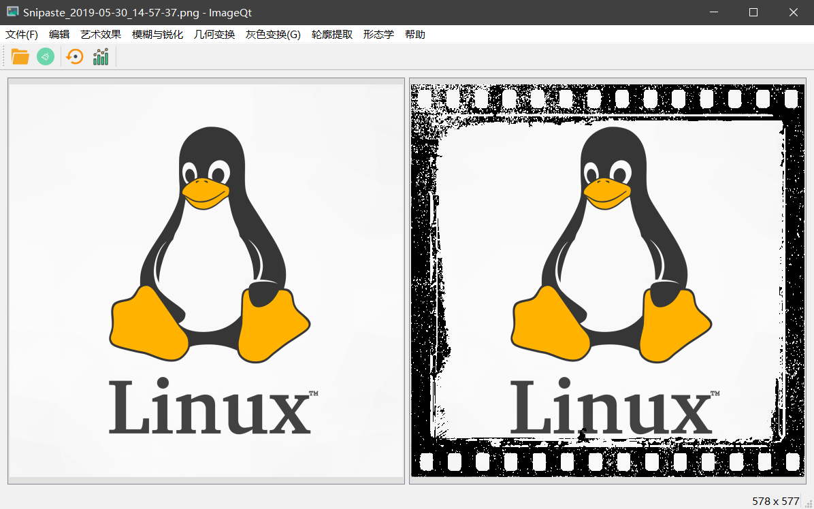
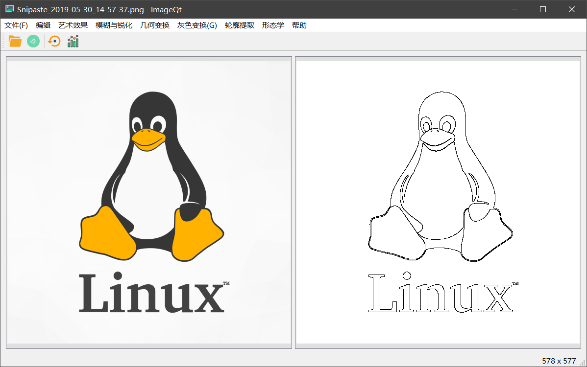

# ImageQt

Image viewer powered by Qt 5.8.0

## 功能（按完成时间排序）

1. 基本的图像查看
2. 图像缩放、旋转、翻转
3. 灰度图像
4. 调节色温
5. 调节亮度
6. 添加相框
7. 金属纹理
8. 语言切换（中/英）支持（已删除）
9. 直方图（包括灰度直方图和各通道直方图）
10. 线性灰度变换
11. 函数图像绘制
12. 指数灰度变换
13. 幂次灰度变换
14. 对数灰度变换
15. 拉伸灰度变换
16. 简单平滑
17. 高斯平滑
18. 中值滤波
19. Laplace锐化
20. Sobel边缘检测

## 截图

